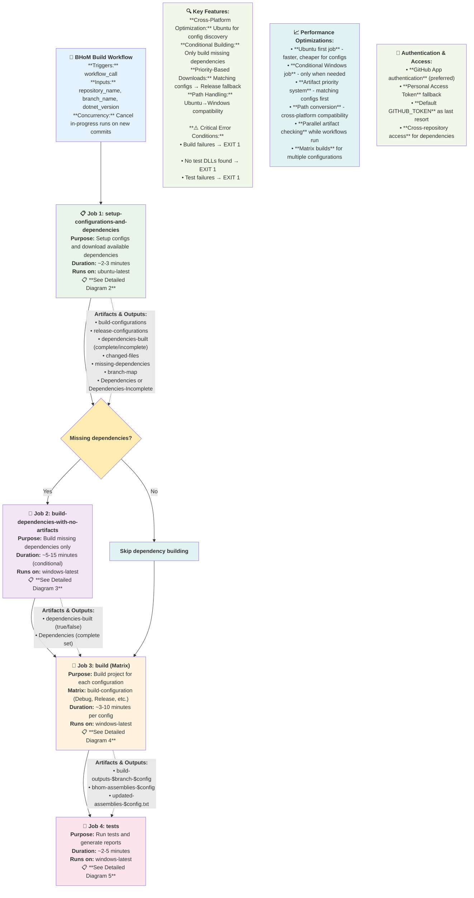
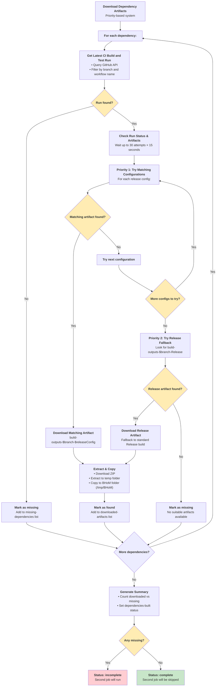
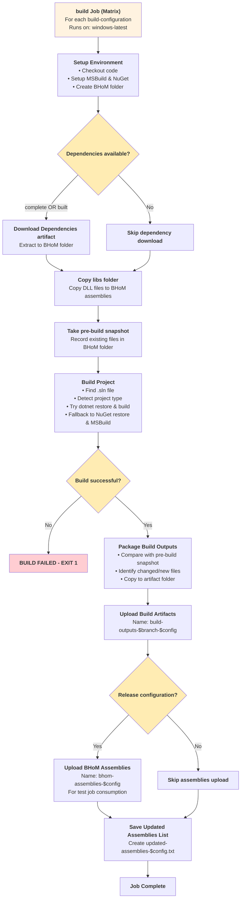
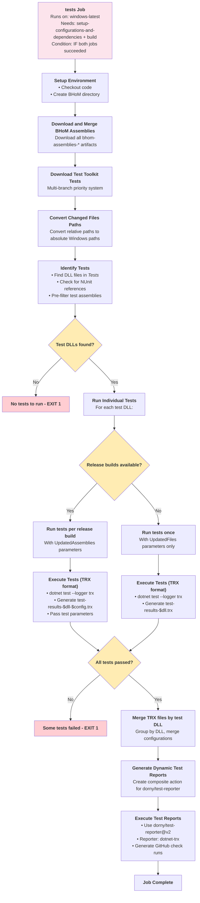
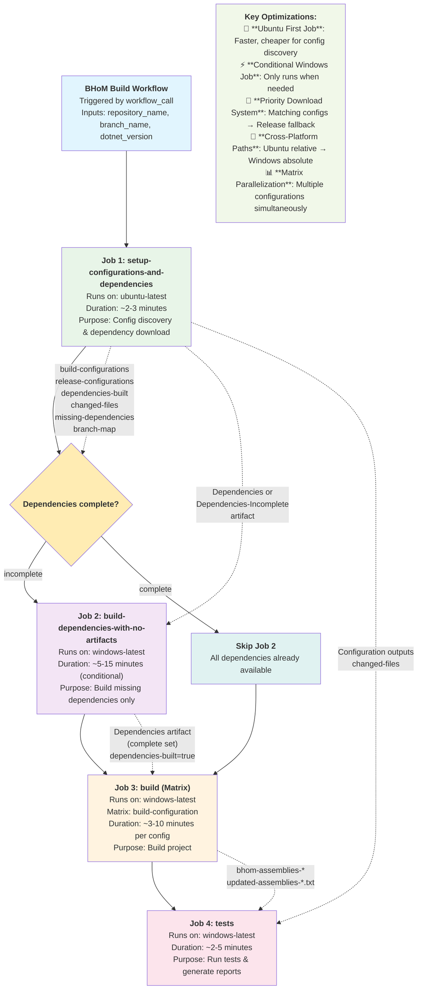
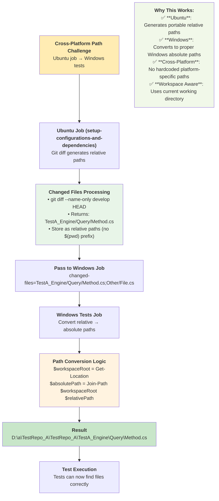

# BHoM CI Workflow Diagrams

This file contains all the diagrams explaining the BHoM Build Workflow. Each section represents a separate tab/diagram that can be imported into Draw.io or other diagramming tools.

---

## Tab 1: Main Overview - BHoM Build Workflow

---

## Tab 2: setup-configurations-and-dependencies Job Detail

```mermaid
graph TD
    A["`**setup-configurations-and-dependencies Job**
    Runs on: ubuntu-latest`"] --> B["`**Discover Build Configurations**
    • Parse .sln file (bash)
    • Extract build configs
    • Identify Release configs
    • Output JSON arrays`"]
    
    B --> C["`**Parse Dependencies**
    • Read dependencies.txt (bash)
    • Extract dependency list
    • Convert to JSON`"]
    
    C --> D["`**Get Changed Files**
    Compare with develop branch`"]
    
    D --> E{"`**Branch = develop?**`"}
    E -->|Yes| F["`**No changed files tracking**`"]
    E -->|No| G["`**Git diff vs develop (bash)**
    • Fetch develop branch
    • Compare files
    • Generate RELATIVE paths (cross-platform)`"]
    
    F --> H["`**Create BHoM folder**
    mkdir -p /tmp/BHoM/Assemblies`"]
    G --> H
    
    H --> I["`**Setup Authentication**
    • Check GitHub App secrets
    • Generate token if available`"]
    
    I --> J["`**Determine Dependency Branches**
    For each dependency:`"]
    J --> K{"`**Target branch exists?**`"}
    K -->|Yes| L["`**Use target branch**`"]
    K -->|No| M["`**Use develop branch**`"]
    
    L --> N["`**Download Dependency Artifacts**
    Priority-based download system`"]
    M --> N
    
    N --> O{"`**All dependencies found?**`"}
    O -->|Yes| P["`**Mark as 'complete'**
    dependencies-built=complete`"]
    O -->|No| Q["`**Mark as 'incomplete'**
    dependencies-built=incomplete
    Track missing dependencies`"]
    
    P --> R["`**Upload Dependencies artifact**
    Complete dependency set`"]
    Q --> S["`**Upload Dependencies-Incomplete artifact**
    Partial dependency set + missing list`"]
    
    R --> T["`**Job Complete**
    Second job will be SKIPPED`"]
    S --> U["`**Job Complete**
    Second job will RUN`"]
    
    style A fill:#e8f5e8
    style E fill:#ffecb3
    style K fill:#ffecb3
    style O fill:#ffecb3
    style P fill:#c8e6c9
    style Q fill:#ffcdd2
```

---

## Tab 3: build-dependencies-with-no-artifacts Job Detail

```mermaid
graph TD
    A["`**build-dependencies-with-no-artifacts Job**
    Runs on: windows-latest
    Condition: IF dependencies-built == 'incomplete'`"] --> B["`**Setup Environment**
    • Checkout code
    • Setup MSBuild & NuGet
    • Create BHoM folder`"]
    
    B --> C["`**Download Dependencies-Incomplete**
    Download partial dependency set`"]
    
    C --> D["`**Restore Existing Dependencies**
    Copy to BHoM folder`"]
    
    D --> E["`**Get Missing Dependencies List**
    Read missing-dependencies.json`"]
    
    E --> F{"`**Any missing dependencies?**`"}
    F -->|No| G["`**Job Complete - Nothing to build**`"]
    F -->|Yes| H["`**Setup Authentication**
    Generate GitHub App token`"]
    
    H --> I["`**Clone Missing Dependencies**
    For each missing dependency:`"]
    I --> J["`**Clone Repository**
    • Get branch from branch-map
    • Clone to Repositories folder
    • Checkout correct branch`"]
    
    J --> K{"`**.sln file exists?**`"}
    K -->|Yes| L["`**Mark as valid for building**`"]
    K -->|No| M["`**Skip - no solution file**`"]
    
    L --> N["`**Analyze Dependency Order**
    • Read dependencies.txt files
    • Create dependency map
    • Topological sort
    • Generate build order`"]
    M --> N
    
    N --> O["`**Build Dependencies in Order**
    For each repository:`"]
    O --> P["`**Detect Project Type**
    • Check for packages.config (legacy)
    • Check for SDK-style projects`"]
    
    P --> Q{"`**Legacy project?**`"}
    Q -->|Yes| R["`**NuGet + MSBuild**
    • nuget restore
    • msbuild /restore /m /p:Configuration=Release`"]
    Q -->|No| S["`**Dotnet CLI**
    • dotnet restore
    • dotnet build --configuration Release`"]
    
    R --> T{"`**Build successful?**`"}
    S --> T
    T -->|No| U["`**BUILD FAILED - EXIT 1**`"]
    T -->|Yes| V["`**Copy outputs to BHoM folder**`"]
    
    V --> W{"`**More dependencies?**`"}
    W -->|Yes| O
    W -->|No| X["`**Upload Complete Dependencies**
    Replace incomplete artifact with complete set`"]
    
    X --> Y["`**Job Complete**
    dependencies-built=true`"]
    
    style A fill:#f3e5f5
    style F fill:#ffecb3
    style K fill:#ffecb3
    style Q fill:#ffecb3
    style T fill:#ffecb3
    style W fill:#ffecb3
    style U fill:#ffcdd2
```

---

## Tab 4: Dependency Artifact Download Process (Priority System)

---

## Tab 5: build Job (Matrix) Detail

---

## Tab 6: tests Job Detail

---

## Tab 7: Job Relationships and Flow

---

## Tab 8: Cross-Platform Path Handling

---

## How to Use These Diagrams

1. **Copy each diagram section** from this file
2. **Create a new tab in Draw.io** for each diagram
3. **Import the Mermaid code** using Draw.io's Mermaid import feature
4. **Customize styling** as needed for your presentation

## Diagram Legend

- **🔷 Diamond shapes**: Decision points (if/else conditions)
- **📦 Rectangle shapes**: Process steps
- **🔴 Red styling**: Critical error conditions that exit the workflow
- **🟡 Yellow styling**: Decision points and conditional logic
- **🟢 Green styling**: Successful completion paths
- **⚡ Dotted arrows**: Data flow and dependencies between jobs
- **➡️ Solid arrows**: Process flow and execution order

## Key Features Illustrated

- **Split Job Architecture**: Ubuntu for configs, Windows for building when needed
- **Conditional Execution**: Second job only runs when dependencies are missing
- **Priority-Based Downloads**: Matching configurations → Release fallback
- **Cross-Platform Path Handling**: Ubuntu relative paths → Windows absolute paths
- **Matrix job execution** for parallel builds
- **Artifact dependencies** between jobs
- **Error handling** and exit conditions
- **Authentication hierarchy** (GitHub App → PAT → Default token)
- **Performance optimizations** (Ubuntu first, conditional building)
- **TRX test reporting** with dorny/test-reporter