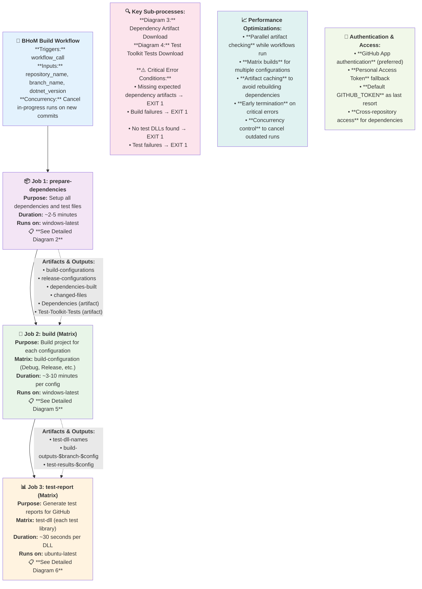
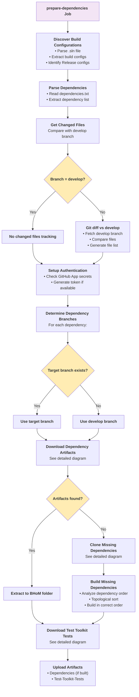
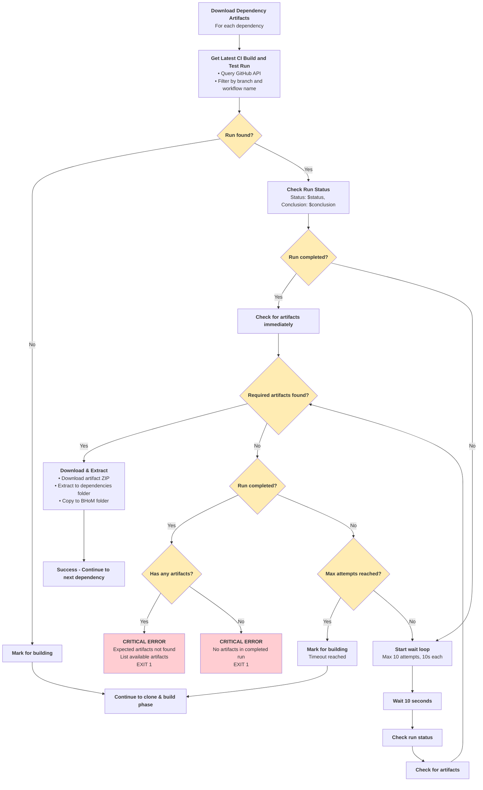
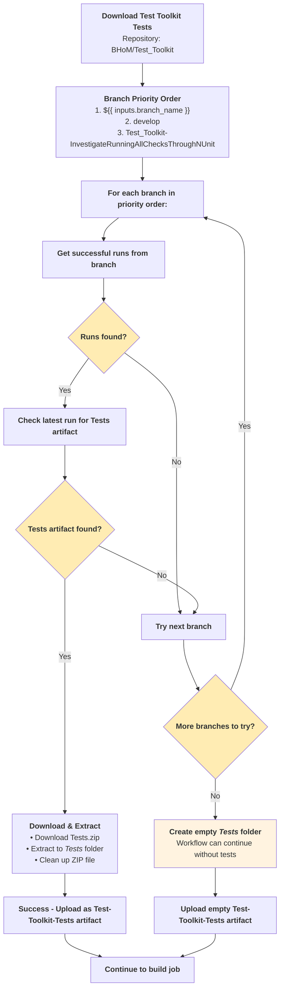
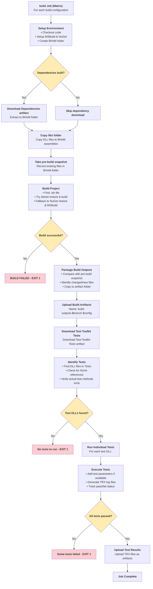
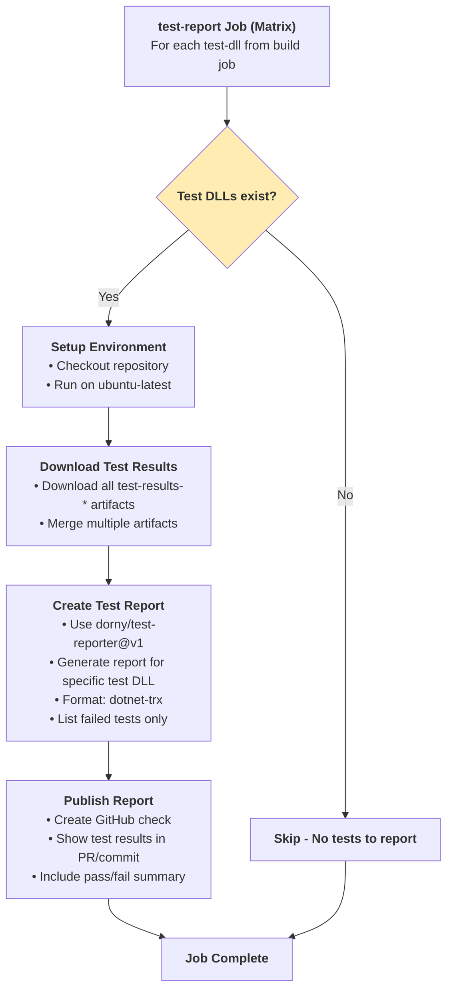
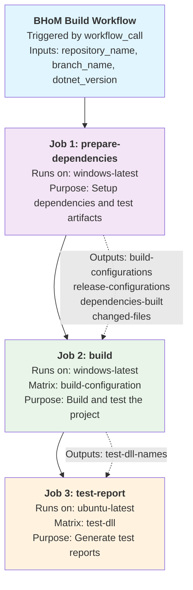

# BHoM CI Workflow Diagrams

This file contains all the diagrams explaining the BHoM Build Workflow. Each section represents a separate tab/diagram that can be imported into Draw.io or other diagramming tools.

---

## Tab 1: Main Overview - BHoM Build Workflow

---

## Tab 2: prepare-dependencies Job Detail

---

## Tab 3: Dependency Artifact Download Process

---

## Tab 4: Test Toolkit Tests Download

---

## Tab 5: build Job (Matrix) Detail

---

## Tab 6: test-report Job (Matrix) Detail

---

## Tab 7: Job Relationships and Flow

---

## How to Use These Diagrams

1. **Copy each diagram section** from this file
2. **Create a new tab in Draw.io** for each diagram
3. **Import the Mermaid code** using Draw.io's Mermaid import feature
4. **Customize styling** as needed for your presentation

## Diagram Legend

- **🔷 Diamond shapes**: Decision points (if/else conditions)
- **📦 Rectangle shapes**: Process steps
- **🔴 Red styling**: Critical error conditions that exit the workflow
- **🟡 Yellow styling**: Decision points and conditional logic
- **🟢 Green styling**: Successful completion paths
- **⚡ Dotted arrows**: Data flow and dependencies between jobs
- **➡️ Solid arrows**: Process flow and execution order

## Key Features Illustrated

- **Concurrency control** and workflow cancellation
- **Matrix job execution** for parallel builds
- **Artifact dependencies** between jobs
- **Error handling** and exit conditions
- **Authentication hierarchy** (GitHub App → PAT → Default token)
- **Performance optimizations** (parallel checking, early termination)
- **Branch prioritization** for test toolkit downloads
- **Wait loops** for running workflows
